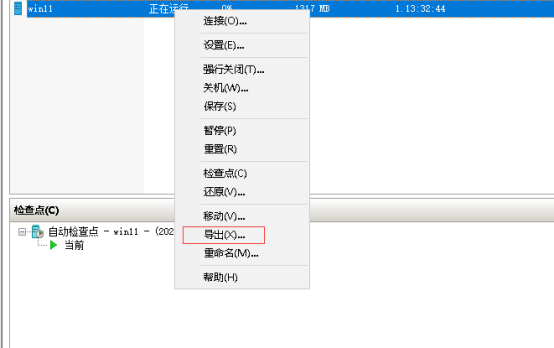

第一步：导出虚拟机

第二步：导入虚拟机，选择创建新的唯一ID

Linux 修改如下内容：

	查看hostnamectl

	修改：sudo hostnamectl set-hostname xxxx

	修改/etc/hosts中 127.0.0.1指向的主机名

导入的Linux会沿用原用户，修改Linux用户步骤：

	1 /etc/shadow 中的原用户修改为新用户

	2 修改开始目录

		cd /home

		mv 原用户 新用户

	3 修改/etc/passwd 中的原用户为新用户

	4 若有组

	vim /etc/group

	:%s/原用户/新用户/g