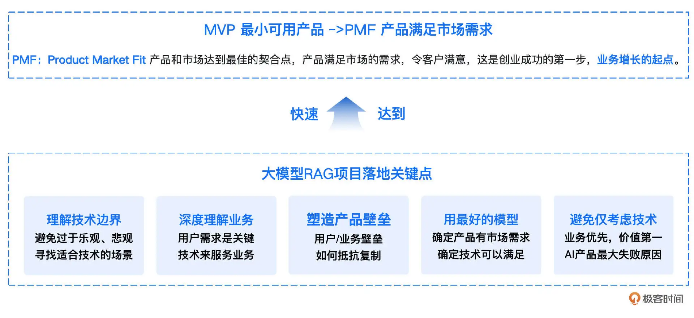
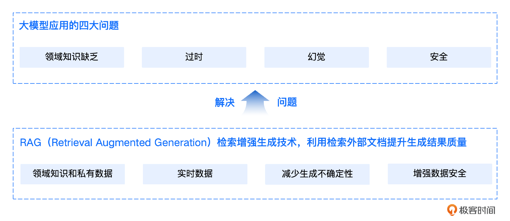
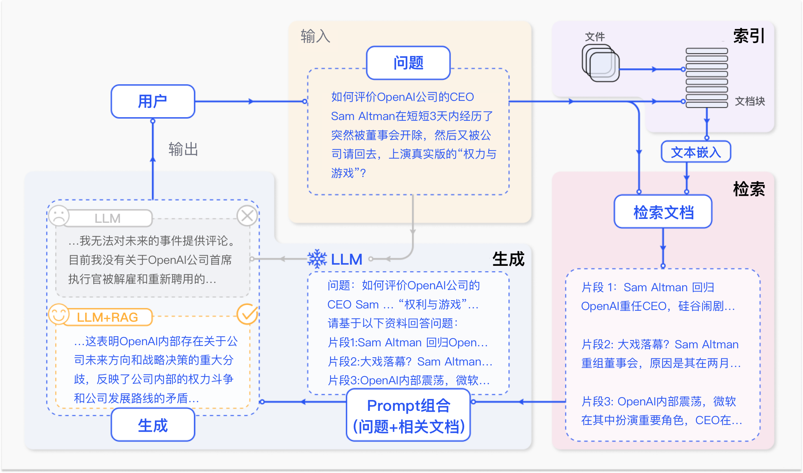
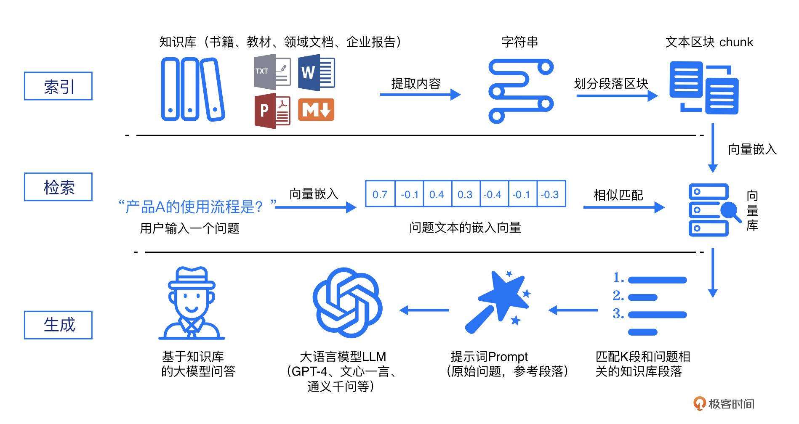
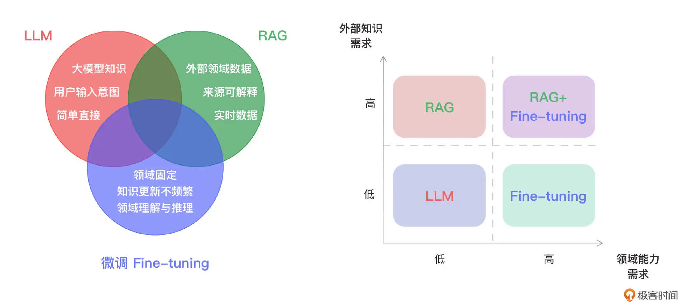

从 MVP（最小可行产品）到 PMF（产品市场契合），本质是从**技术可行性验证**走向**商业可持续性验证**的过程，AI 产品因技术特性和行业特性，面临的挑战比传统产品更复杂。

MVP 解决的是 “**能不能做出来**”，而 PMF 解决的是 “**有没有人愿意持续用、愿意付费**”。AI 产品的特殊性在于：技术门槛低导致竞争激烈，模型效果不稳定导致体验波动，数据壁垒导致规模化难，这些都让从 MVP 到 PMF 的路径比传统产品更陡峭、更不确定。

要实现 AI 产品的 PMF，首先需要充分了解 AI 技术，明确技术的边界，避免盲目乐观或悲观，找到合适 AI 技术的应用场景。其次，深刻理解业务是关键，用户需求决定产品方向，AI 技术则是为业务服务的工具。在验证阶段，优先使用最佳 AI 模型以确保产品满足市场需求，确认后再逐步降低模型成本。在整个过程中，要始终坚持业务优先、价值至上的原则，避免团队走向纯 AI 科研化，脱离实际应用场景做 AI 技术选型。最关键的是，通过构建 AI 产品的独特壁垒，有效抵御增长过程中竞争者的模仿与复制。

尽管大模型功能强大，但它当前仍存在幻觉、知识时效性、领域知识不足及数据安全问题的局限性。RAG（Retrieval Augmented Generation，检索增强生成）技术正是在这样的背景下应运而生，成为了当前大模型应用的重要技术方向，文档问答类 LLM RAG 应用也被认为是 AI 2.0 时代最早落地的应用类型之一。RAG 技术使开发者能够在无需为每个特定任务重新训练或微调大模型的情况下，通过连接外部知识库和文档，为模型注入额外的非参数化知识，从而显著提升其在专业领域的能力和回答精度。RAG 技术赋予大模型在各行各业和各种垂直场景中巨大的效率和体验价值，有望成为最快涌现的“杀手级应用”，已成为大模型应用落地最热门的方向之一。

最大的变化是 AI 技术的深度使用，需要更加深入地理解 AI 技术组件，具备调整组件内部细节的能力，以便进行更好的 AI 软件编排和提升应用效果。比如文档分块、向量化嵌入、向量数据库、相似度查询、召回、重排序、大模型和提示词等众多 AI 相关概念，都需要深入了解，才能根据业务场景进行最合适的技术选型。

模型仍然存在一些无法忽视的局限性。其中，领域知识缺乏是最明显的问题。大模型的知识来源于训练数据，这些数据主要来自公开的互联网和开源数据集，无法覆盖特定领域或高度专业化的内部知识。信息过时则指模型难以处理实时信息，因为训练过程耗时且成本高昂，模型一旦训练完成，就难以获取和处理新信息。此外，幻觉问题是另一个显著的局限，模型基于概率生成文本，有时会输出看似合理但实际错误的答案。最后，数据安全性在企业应用中尤为重要，如何在确保数据安全的前提下，使大模型有效利用私有数据进行推理和生成，是一个具有挑战性的问题。

为了解决这些问题，仅依赖 LLM 本身是不足的。RAG（Retrieval-Augmented Generation，检索增强生成）技术应运而生。通过将非参数化的外部知识库、文档与大模型相结合，RAG 使模型在生成内容之前，能够先检索相关信息，从而弥补模型在知识专业性和时效性上的不足，减少生成不确定性，在确保数据安全的同时，充分利用领域知识和私有数据。

在图中 RAG 的案例中，用户提出了一个涉及 OpenAI 公司 CEO Sam Altman 的实时问题，询问其在短时间内被解雇和重聘的事件。在不使用 RAG 的情况下，由于大语言模型（LLM）无法访问实时更新的外部信息，用户只能得到一个无法提供有效回答的结果。而通过 RAG 技术，将相关的实时信息转化为知识库内容，并通过检索模块检索到与用户查询高度相关的文档片段，最终生成的回答不仅准确，而且涵盖了实时信息的背景和细节，为用户提供了有价值的解答。

RAG 模型的核心思想在于通过检索与生成的有机结合，弥补大模型在处理领域问题和实时任务时的不足。

RAG 标准流程由索引（Indexing）、检索（Retriever）和生成（Generation）三个核心阶段组成。

1. 索引阶段，通过处理多种来源多种格式的文档提取其中文本，将其切分为标准长度的文本块（chunk），并进行嵌入向量化（embedding），向量存储在向量数据库（vector database）中。
2. 检索阶段，用户输入的查询（query）被转化为向量表示，通过相似度匹配从向量数据库中检索出最相关的文本块。
3. 最后生成阶段，检索到的相关文本与原始查询共同构成提示词（Prompt），输入大语言模型（LLM），生成精确且具备上下文关联的回答。

通过这一流程，RAG 实现了检索与生成的有机结合，显著提升了 LLM 在领域任务中的准确性和实时性。

索引是 RAG 系统的基础环节，包含四个关键步骤。
1. 首先，将各类数据源及其格式（如书籍、教材、领域数据、企业文档等，txt、markdown、doc、ppt、excel、pdf、html、json 等格式）统一解析为纯文本格式。
2. 接着，根据文本的语义或文档结构，将文档分割为小而语义完整的文本块（chunks），确保系统能够高效检索和利用这些块中包含的信息。
3. 然后，使用文本嵌入模型（embedding model），将这些文本块向量化，生成高维稠密向量，转换为计算机可理解的语义表示。
4. 最后，将这些向量存储在向量数据库 (vector database) 中，并构建索引，完成知识库的构建。这一流程成功将外部文档转化为可检索的向量，支撑后续的检索和生成环节。

检索是连接用户查询与知识库的核心环节。首先，用户输入的问题通过同样的文本嵌入模型转换为向量表示，将查询映射到与知识库内容相同的向量空间中。通过相似度度量方法，检索模块从向量数据库中筛选出与查询最相关的前 K 个文本块，这些文本块将作为生成阶段输入的一部分。通过相似性搜索，检索模块有效获取了与用户查询切实相关的外部知识，为生成阶段提供了精确且有意义的上下文支持。

生成是 RAG 流程中的最终环节，将检索到的相关文本块与用户的原始查询整合为增强提示词（Prompt），并输入到大语言模型（LLM）中。LLM 基于这些输入生成最终的回答，确保生成内容既符合用户的查询意图，又充分利用了检索到的上下文信息，使得回答更加准确和相关，充分使用到知识库中的知识。通过这一过程，RAG 实现了具备领域知识和私有信息的精确内容生成。

RAG与微调

RAG 擅长于高效整合外部知识，尤其在频繁处理实时信息，或者需要回答复杂且依赖外部知识的问题、回答需要具备可解释性需求时，RAG 通过结合检索系统和生成模型，能够实时利用最新信息，生成上下文相关且准确的答案。因此，当应用场景对外部知识的利用有较高需求时，RAG 是更为适宜的方案。微调更适合需求稳定、领域知识固定且不需要频繁更新知识库的场景。通过使用特定领域的数据对模型进行深度优化，微调可以提升模型在特定任务或领域中的推理能力，确保输出内容的专业性和一致性。因此，当任务侧重于某一特定领域，并且对实时信息的依赖较低时，微调更能满足这些需求。总的来说，RAG 更适用于需要动态响应、频繁更新外部知识的场景，而微调则适合固定领域内的深度优化与推理。当应用场景中既需要利用最新的外部知识，又需要保持高水平的领域推理能力时，可以考虑结合使用 RAG 和微调，以实现最优的性能和效果。

