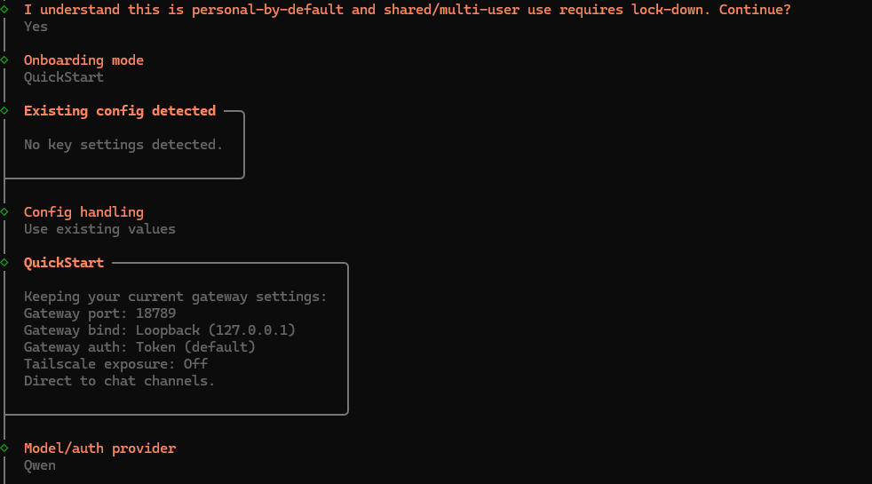
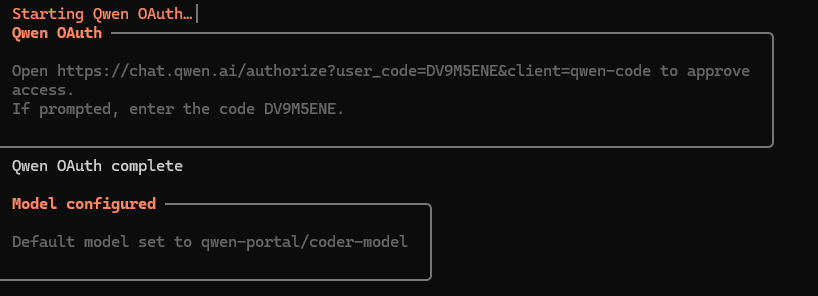
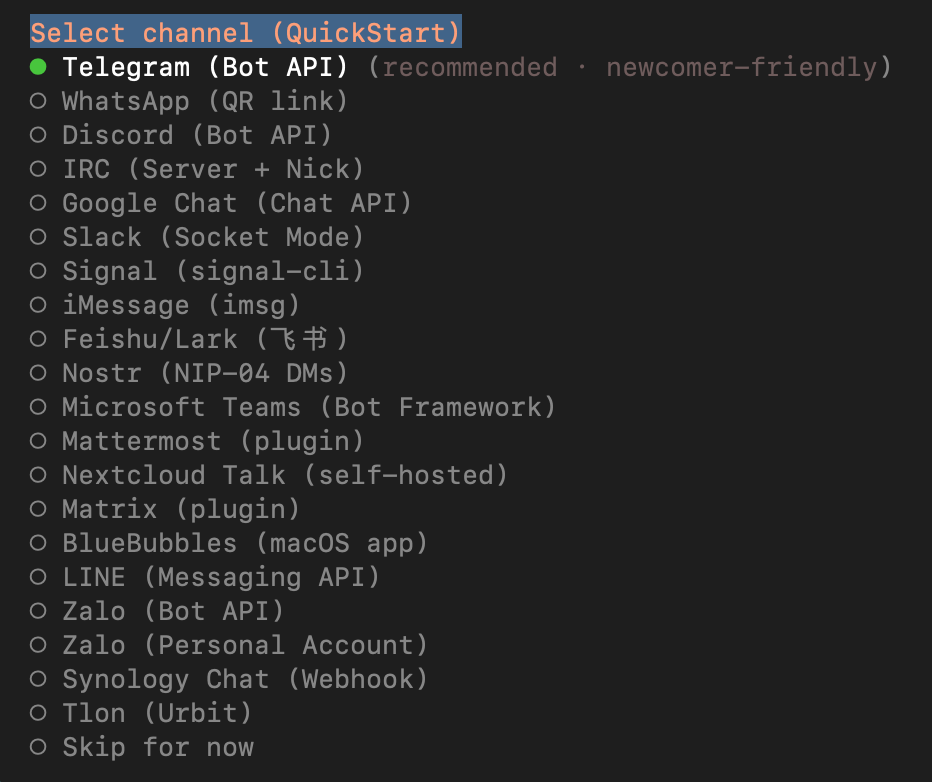
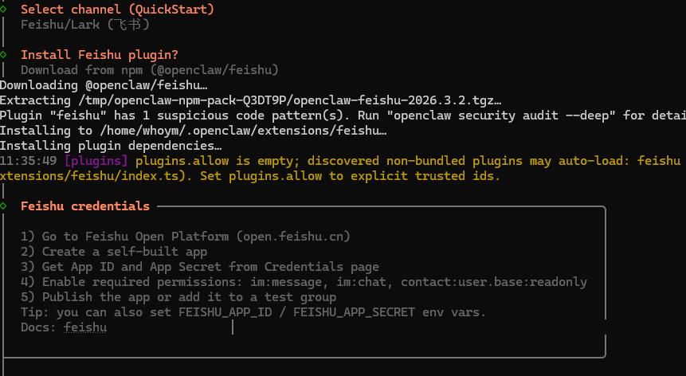

OpenClaw 的官网在：https://openclaw.ai
官方文档在：https://docs.openclaw.ai/zh-CN
github 上的项目地址为：https://github.com/openclaw/openclaw

安装 OpenClaw 推荐的操作系统是 Linux 和 macOS，因此在Windows下，可以在 WSL2 的 Linux 环境中安装 OpenClaw。

```
Windows10/11 下安装WSL2（Windows Subsystem for Linux 2）

- 以管理员身份运行 PowerShell：wsl --install
  安装成功后，在终端运行：ubuntu，输入用户名和密码登录
  
  
性能优化（.wslconfig） 在 _C:\Users\<用户名>\.wslconfig_ 中添加：
[wsl2]
memory=4GB
processors=4
swap=8GB
autoMemoryReclaim=true
localhostForwarding=true
guiApplications=true

```

安装linubrew：
```
/bin/bash -c "$(curl -fsSL https://raw.githubusercontent.com/Homebrew/install/HEAD/install.sh)"
```

如果安装很耗时，可以使用镜像：
```
export HOMEBREW_BREW_GIT_REMOTE="https://mirrors.tuna.tsinghua.edu.cn/git/homebrew/brew.git"
export HOMEBREW_CORE_GIT_REMOTE="https://mirrors.tuna.tsinghua.edu.cn/git/homebrew/homebrew-core.git"
/bin/bash -c "$(curl -fsSL https://raw.githubusercontent.com/Homebrew/install/HEAD/install.sh)"
```

安装成功后，运行：
```
echo 'eval "$(/home/linuxbrew/.linuxbrew/bin/brew shellenv)"' >> ~/.bashrc
source ~/.bashrc
brew -v
```

预装的软件NodeJS（>=22）、git
```
brew install node@24
echo 'export PATH="/home/linuxbrew/.linuxbrew/opt/node@24/bin:$PATH"' >> ~/.profile
source ~/.profile
node -v
```

另外一种按照nodejs，上面用homebrew按照下载依赖包太多了
```
# 下载并安装 nvm：
curl -o- https://raw.githubusercontent.com/nvm-sh/nvm/v0.40.3/install.sh | bash

# 代替重启 shell
\. "$HOME/.nvm/nvm.sh"

# 下载并安装 Node.js：
nvm install 24

# 验证 Node.js 版本：
node -v # Should print "v24.14.0".

# 验证 npm 版本：
npm -v # Should print "11.9.0".

```

安装openclaw，以后要升级 OpenClaw，还是这条命令。
```
curl -sSL https://openclaw.ai/install.sh | bash
```

安装成功后，若没有出现配置画面，可在终端运行
```
openclaw onboard --install-daemon
```

按照提示来进行选择


选择相应的大模型，比如qwen时，按照上面提示操作即可


接下来配置 IM 工具。选择飞书


Install Feishu plugin，选择 Download from npm


