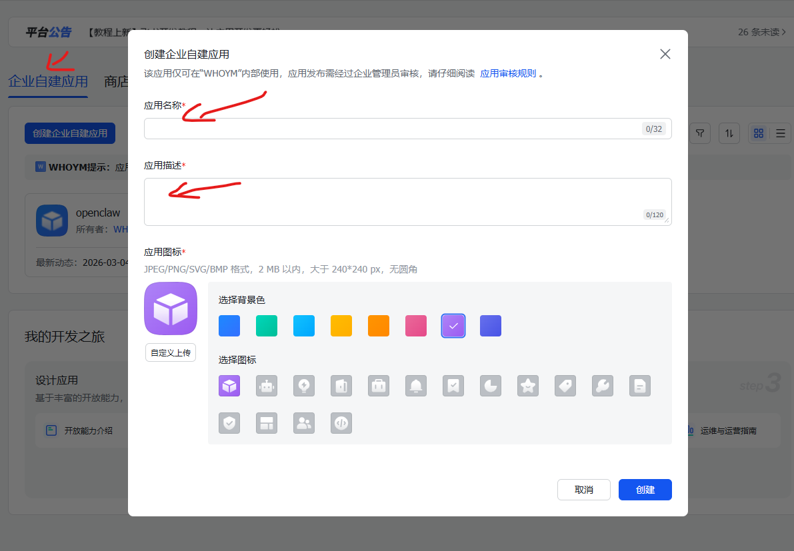
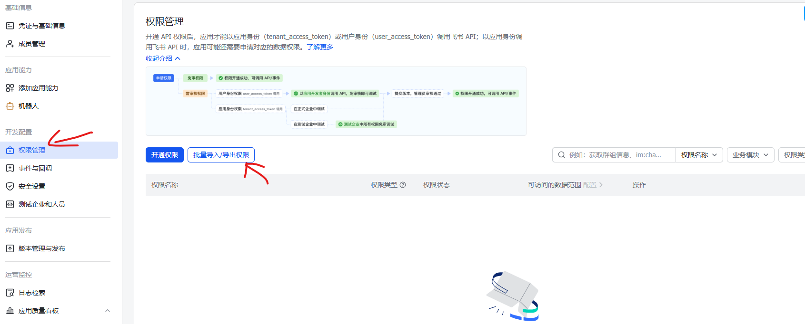
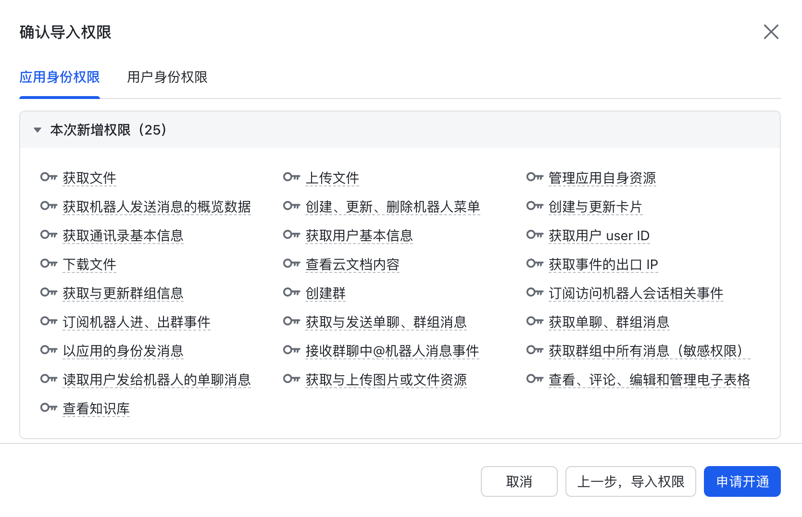
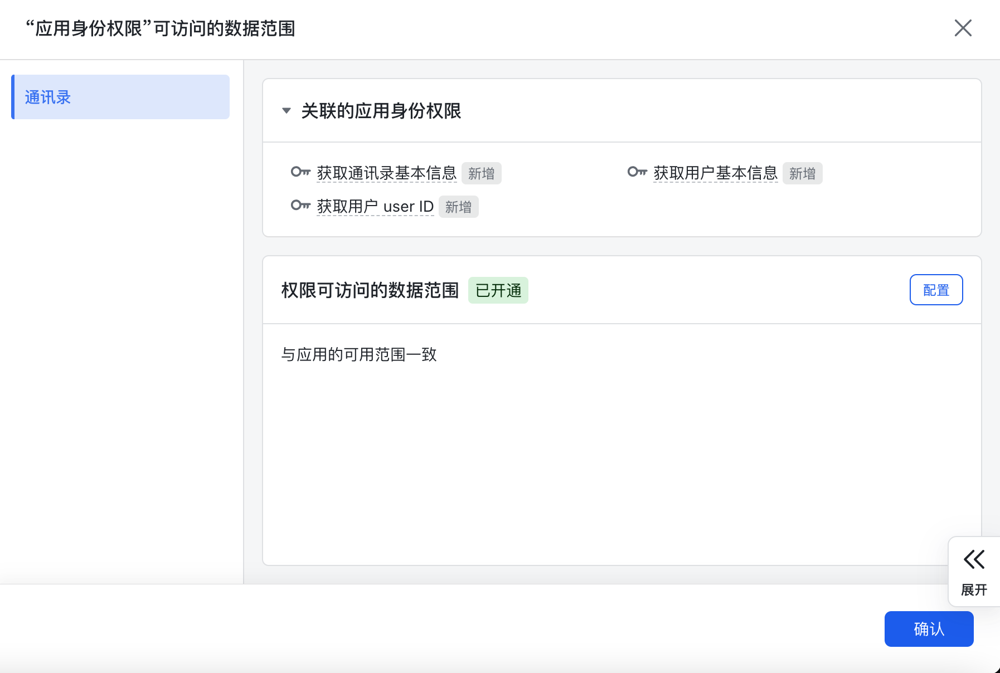
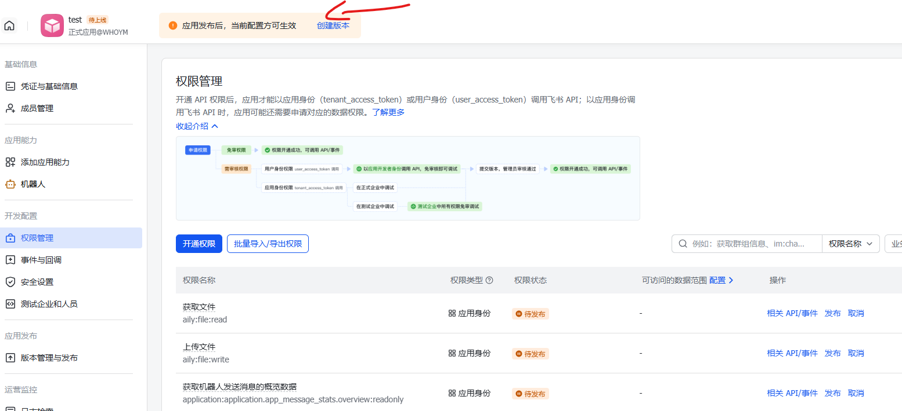
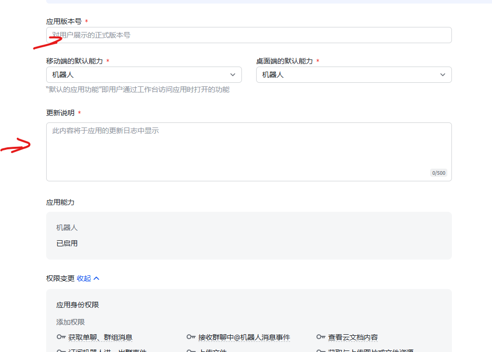

OpenClaw 的官网在：https://openclaw.ai
官方文档在：https://docs.openclaw.ai/zh-CN
github 上的项目地址为：https://github.com/openclaw/openclaw

安装 OpenClaw 推荐的操作系统是 Linux 和 macOS，因此在Windows下，可以在 WSL2 的 Linux 环境中安装 OpenClaw。

```
Windows10/11 下安装WSL2（Windows Subsystem for Linux 2）

- 以管理员身份运行 PowerShell：wsl --install
  安装成功后，在终端运行：ubuntu，输入用户名和密码登录
  
  
性能优化（.wslconfig） 在 _C:\Users\<用户名>\.wslconfig_ 中添加：
[wsl2]
memory=4GB
processors=4
swap=8GB
autoMemoryReclaim=true
localhostForwarding=true
guiApplications=true

```

安装linubrew：
```
/bin/bash -c "$(curl -fsSL https://raw.githubusercontent.com/Homebrew/install/HEAD/install.sh)"
```

如果安装很耗时，可以使用镜像：
```
export HOMEBREW_BREW_GIT_REMOTE="https://mirrors.tuna.tsinghua.edu.cn/git/homebrew/brew.git"
export HOMEBREW_CORE_GIT_REMOTE="https://mirrors.tuna.tsinghua.edu.cn/git/homebrew/homebrew-core.git"
/bin/bash -c "$(curl -fsSL https://raw.githubusercontent.com/Homebrew/install/HEAD/install.sh)"
```

安装成功后，运行：
```
echo 'eval "$(/home/linuxbrew/.linuxbrew/bin/brew shellenv)"' >> ~/.bashrc
source ~/.bashrc
brew -v
```

预装的软件NodeJS（>=22）、git
```
brew install node@24
echo 'export PATH="/home/linuxbrew/.linuxbrew/opt/node@24/bin:$PATH"' >> ~/.profile
source ~/.profile
node -v
```

另外一种按照nodejs，上面用homebrew按照下载依赖包太多了
```
# 下载并安装 nvm：
curl -o- https://raw.githubusercontent.com/nvm-sh/nvm/v0.40.3/install.sh | bash

# 代替重启 shell
\. "$HOME/.nvm/nvm.sh"

# 下载并安装 Node.js：
nvm install 24

# 验证 Node.js 版本：
node -v # Should print "v24.14.0".

# 验证 npm 版本：
npm -v # Should print "11.9.0".

```

安装openclaw，以后要升级 OpenClaw，还是这条命令。
```
curl -sSL https://openclaw.ai/install.sh | bash
```

安装成功后，若没有出现配置画面，可在终端运行
```
openclaw onboard --install-daemon
```

按照提示来进行选择


选择相应的大模型，比如qwen时，按照上面提示操作即可


接下来配置 IM 工具。选择飞书


Install Feishu plugin，选择 Download from npm


飞书插件安装好后，进行飞书配置

1、登录飞书开放平台（open.feishu.cn），选择“创建企业自建应用”。

将内容填写

2、应用创建后，选择“添加应用能力”中的“机器人”。


3、添加权限管理


4、复制以下内容，替换对话框中的 JSON 内容，然后点击“下一步，确认新增权限”。
```
{
  "scopes": {
    "tenant": [
      "aily:file:read",
      "aily:file:write",
      "application:application.app_message_stats.overview:readonly",
      "application:application:self_manage",
      "application:bot.menu:write",
      "cardkit:card:write",
      "contact:contact.base:readonly",
      "contact:user.base:readonly",
      "contact:user.employee_id:readonly",
      "corehr:file:download",
      "docs:document.content:read",
      "event:ip_list",
      "im:chat",
      "im:chat.access_event.bot_p2p_chat:read",
      "im:chat.members:bot_access",
      "im:chat:create",
      "im:message",
      "im:message.group_at_msg:readonly",
      "im:message.group_msg",
      "im:message.p2p_msg:readonly",
      "im:message:readonly",
      "im:message:send_as_bot",
      "im:resource",
      "sheets:spreadsheet",
      "wiki:wiki:readonly"
    ],
    "user": [
      "aily:file:read",
      "aily:file:write",
      "contact:user.employee_id:readonly",
      "im:chat",
      "im:chat.access_event.bot_p2p_chat:read",
      "im:chat:read",
      "im:chat:readonly"
    ]
  }
}
```

5、出现新的对话框，点击“申请开通”


6、出现下面这个界面，不需要做任何修改，直接点击“确认”。


7、创建版本


8、输入版本号，并保存


9、出现对话框，点击“确认发布”。


